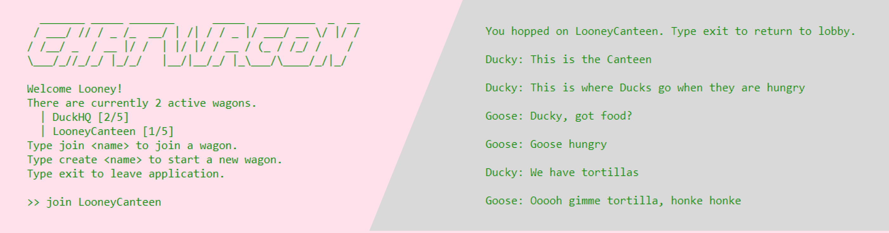

# Chatwagon

## Overview 
Chatwagon is a CLI chat application that allows intercommunication of nodes using the Node.js `net` module, the de facto language library for TCP socket connections.

## Components 
### Chat Server
To run the chat server, enter  
`node chatserver.js` 

The server will keep a log of all significant client activity.

### Chat Clients 
Run any number of chat clients by opening separate terminals, and entering  
`node chatclient.js` 

You may provide a custom username for your client by entering these arguments and swapping <yourName> with a preferred username.  
`node chatclient.js localhost 8080 <yourName>`

## User Interface
### Lobby
To create a room,  
`create <yourRoom>` 

To join a room,  
`join <someRoom>` 

To exit application,  
`exit`

### Wagon
To chat, type anything and press enter to broadcast your message to the Wagon chatroom. 

To exit to lobby,  
`exit`

## Test
To run unit tests,  
`node test.js`

